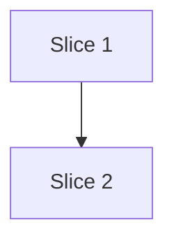

# Plan

Role: orchestrator. This command creates a structured plan — it does not implement anything.

You have been invoked with the `/plan` command.

## Orchestrator constraints

1. **Do not implement.** Produce only the plan. No code, no scaffolding, no file edits beyond the plan file itself.
2. **Every step must be TDD.** Each step follows RED → GREEN → REFACTOR.
3. **Incremental.** Each step must leave the codebase in a working, committable state.
4. **Human approval required.** Present the plan for approval before any implementation begins.
5. **Be concise.** The plan is the artifact; keep chat to decisions and gaps.

## Parse Arguments

Arguments: $ARGUMENTS

- Positional: task description (required)
- `--output <path>`: Write plan to a specific path. Default: `plans/<slugified-task>.md`

## Steps

### 1. Check for spec artifacts

Search for specification artifacts produced by `/specs` — look for files matching `docs/specs/**` or `specs/**` related to the task. Check for the three artifacts: Intent Description, Architecture Specification, and Acceptance Criteria. The spec does **not** contain Gherkin — authoring the behavioral scenarios is this command's job.

If no spec artifacts are found, ask the user: "No specification artifacts found for this task. Run `/specs` first to produce them, or continue planning without specs?"

If the user chooses to continue without specs, proceed. Otherwise, stop and let them run `/specs` first.

### 2. Understand the task and cut the slices

Read relevant code and context to understand what needs to change. Keep exploration focused — this is planning, not research. If the task is complex enough to need deep research, suggest `/design-doc` instead. If spec artifacts exist, use them as the primary source for goals, constraints, and acceptance criteria.

Then **decompose the feature into vertical slices**. A slice is a vertically deliverable increment — independently testable and, ideally, independently shippable. For each slice, **author the Gherkin scenario(s)** that define its observable behavior. This is where the behavioral contract is written; the spec only described the change and its goals.

When authoring each slice's Gherkin, cover:

- **Happy path** — the primary success behavior.
- **Negative cases** — invalid, unauthorized, missing, or malformed input.
- **Edge cases** — empty collections, boundary values, concurrent access, idempotency.
- **Error scenarios** — specify observable error behavior, not just "should fail".

Keep scenarios implementation-independent (no databases, selectors, or internal data structures in step text) and deterministic. Every acceptance criterion from the spec must be covered by at least one scenario across the slices. Each TDD step traces back to one or more scenarios in its slice.

### 3. Create the plan

Write the plan file using this structure:

````markdown
# Plan: <Task Title>

**Created**: <date>
**Branch**: <current branch>
**Status**: draft

## Goal

<One paragraph describing what this plan achieves and why.>

## Acceptance Criteria

- [ ] <Criterion 1 — observable, testable>
- [ ] <Criterion 2>
- [ ] <Criterion 3>

## Slices

A slice is a vertically deliverable increment. Each slice carries the Gherkin
scenario(s) that define its behavior, followed by the TDD steps that satisfy them.
Steps are numbered `<slice>.<step>` (1.1, 1.2, 2.1, …).

### Slice 1: <Slice Name>

**Depends-on:** none
**Files:** `path/to/file.ts`, `path/to/file.test.ts`

**Behavior:**

```gherkin
Feature: <feature name>

  Scenario: <happy path>
    Given <precondition>
    When <action>
    Then <observable outcome>

  Scenario: <negative / edge / error case>
    Given <precondition>
    When <action>
    Then <observable outcome>
```

**Steps:**

#### Step 1.1: <Description>

**Complexity**: <trivial | standard | complex>
**RED**: Write test for <scenario / behavior>
**GREEN**: Implement <minimal code to pass>
**REFACTOR**: <What to clean up, or "None needed">
**Files**: `path/to/file.ts`, `path/to/file.test.ts`
**Commit**: `<draft commit message>`

#### Step 1.2: <Description>

...

### Slice 2: <Slice Name>

**Depends-on:** 1
**Files:** `path/to/other.ts`

**Behavior:**

```gherkin
...
```

**Steps:**

#### Step 2.1: <Description>

...

## Parallelization

Each slice declares `Depends-on` (slice ids it must follow, or `none`). The build
**waves** are derived from those declarations by `scripts/plan-waves.sh` — do not
hand-maintain them. Independent slices in the same wave can be built concurrently
(`/build` dispatches them to isolated worktrees).



| Wave | Slices (parallel) |
|------|-------------------|
| 1 | 1 |
| 2 | 2 |

If `plan-waves.sh` reports a cycle, a missing `Depends-on`, an unknown reference,
or a **same-wave file collision** (two slices in one wave declaring the same file),
fix the plan before the human gate — those break safe concurrent delivery.

## Complexity Classification

Each step must include a complexity rating that controls review depth during `/build`:

| Rating | Criteria | Review depth |
|--------|----------|--------------|
| `trivial` | Single-file rename, config change, typo fix, documentation-only | Skip inline review; covered by final `/code-review` |
| `standard` | New function, test, module, or behavioral change within existing patterns | Spec-compliance + relevant quality agents |
| `complex` | Architectural change, security-sensitive, cross-cutting concern, new abstraction | Full agent suite including opus-tier agents |

When in doubt, classify up (standard rather than trivial, complex rather than standard).

## Pre-PR Quality Gate

- [ ] All tests pass
- [ ] Type check passes (if applicable)
- [ ] Linter passes
- [ ] `/code-review` passes
- [ ] Documentation updated (if applicable)

## Risks & Open Questions

- <Risk or question, with mitigation or who should answer>

## Build Progress

This section is the machine-parseable recovery handle. `/build` updates checkboxes here via Edit tool so progress survives a `/clear` or session restart. `/continue` reads this section to determine the resume point.

### Slices (grouped by wave)

#### Wave 1
- [ ] Slice 1: <title>
  - [ ] Step 1.1: <title>
  - [ ] Step 1.2: <title>

#### Wave 2
- [ ] Slice 2: <title>
  - [ ] Step 2.1: <title>

### Acceptance Criteria

- [ ] <Criterion 1 — mirrors the Acceptance Criteria section above>
- [ ] <Criterion 2>
- [ ] <Criterion 3>
````

### 4. Create the plans directory

Create `plans/` if it doesn't exist. When writing the plan file, populate the `## Build Progress` section by copying slice and step titles from `## Slices` and criteria from `## Acceptance Criteria`. These are the checkboxes `/build` will update on disk as each step completes — a slice is checked off once all its steps are.

Then derive the waves — never hand-author them:

```bash
bash ${CLAUDE_PLUGIN_ROOT}/scripts/plan-waves.sh <plan-file>
```

Render the `## Parallelization` Mermaid DAG + wave table and the wave-grouped
`## Build Progress` from its JSON (`waves`, per-slice `wave`). If it exits non-zero
(cycle, missing `Depends-on`, or unknown reference) or reports a `collisions` entry,
fix the plan and re-run before the human gate — those defeat safe concurrent build.

### 5. Run plan review personas

Before presenting to the user, dispatch **five plan review personas in parallel** as sub-agents. Each critically challenges the plan from a different perspective:

| Reviewer | Template | Model | Focus |
|----------|----------|-------|-------|
| Acceptance Test Critic | `${CLAUDE_PLUGIN_ROOT}/prompts/plan-review-acceptance.md` | `sonnet` | Per-slice Gherkin quality (determinism, isolation, implementation-independence), scenario gaps, error paths, criteria coverage, TDD traceability |
| Design & Architecture Critic | `${CLAUDE_PLUGIN_ROOT}/prompts/plan-review-design.md` | `sonnet` | Coupling, abstractions, structural risks, pattern adherence |
| UX Critic | `${CLAUDE_PLUGIN_ROOT}/prompts/plan-review-ux.md` | `sonnet` | User journey, error UX, cognitive load, accessibility |
| Strategic Critic | `${CLAUDE_PLUGIN_ROOT}/prompts/plan-review-strategic.md` | `sonnet` | Problem fit, scope, slice boundaries, risk, opportunity cost |
| Parallelization Critic | `${CLAUDE_PLUGIN_ROOT}/prompts/plan-review-parallelization.md` | `sonnet` | Same-wave independence: file-overlap collisions (from `plan-waves.sh`), disjoint-file behavioral coupling, residual cycles/mis-layering |

Pass each reviewer the full plan content. Also pass the Parallelization Critic the `scripts/plan-waves.sh` JSON for this plan (its `collisions` array is the deterministic input). Each returns a structured verdict (`approve` or `needs-revision`) with issues. The Acceptance Test Critic is the gate for the scenarios authored in step 2 — it validates the per-slice Gherkin the same way `feature-file-validation` would, so no separate scenario-review pass is needed before the human gate. A `needs-revision` from the Parallelization Critic triggers plan revision (re-wave the colliding slices) before the human sees the plan.

**If any reviewer returns `needs-revision`**: Address all `blocker` issues by revising the plan. Re-run only the reviewers that flagged blockers. Repeat until all pass (max 2 iterations — escalate to user if still failing).

**After all pass**: Append a `## Plan Review Summary` section to the plan file with the aggregated findings (warnings and observations from all five reviewers).

### 6. Present for approval

Display the plan and the review summary. Ask: "Approve this plan to begin implementation, or suggest changes?"

Mark the plan status as `approved` once the user confirms. If the user requests changes, update the plan and re-present.

#### Post-approval: offer GitHub issues (GitHub origin only)

After approval, classify the origin remote — **only** offer issue creation on an actual GitHub host:

```bash
bash ${CLAUDE_PLUGIN_ROOT}/scripts/git-origin-host.sh
```

- **`github`** → prompt **once**, showing the count: *"Open 1 parent issue and N linked slice issues from this plan? [y/N]"* (N = number of slices). The default is **No**. Invoke `/issues-from-plan` **only on explicit `y`**; on No (or anything else), create nothing and continue.
- **`other`** (non-GitHub host, including lookalikes like `notgithub.example.com`) or **`none`** (no origin) → **no prompt**; continue silently.
- **Non-interactive** (`/plan` run without a usable TTY) → do **not** prompt or block: log *"skipping the GitHub issue prompt (non-interactive)"* and continue.

Never create issues without an explicit `y` on an interactive GitHub-origin prompt.

## Integration

- The progress-guardian agent tracks step completion against this plan
- `/continue` reads active plans to resume work
- The orchestrator's Phase 2 produces plans in this same format for larger tasks
